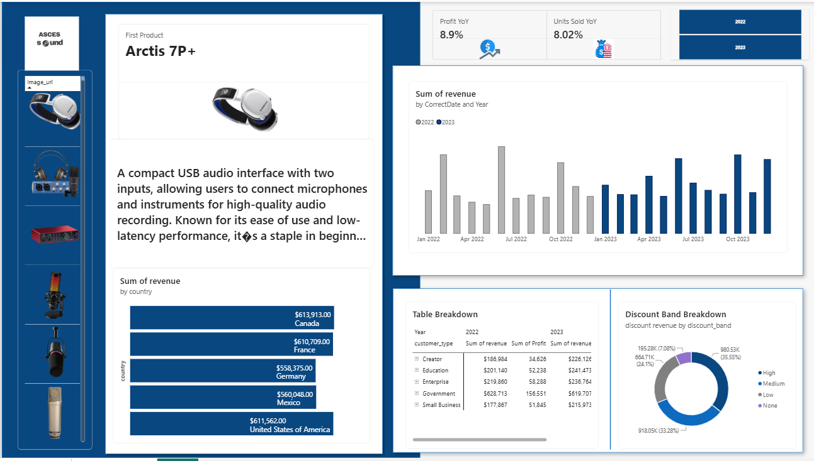
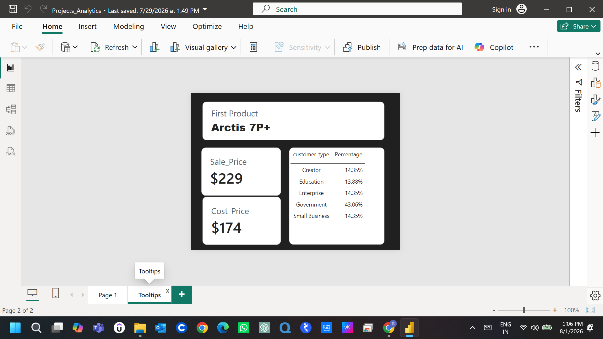

# Asces Sound — Product Analytics Dashboard

**A high-level, one-page Product Analytics Dashboard built for a fictional audio-equipment brand (Asces Sound), covering revenue, profit, and discount performance across countries and customer segments.**

> Built as a guided learning project (course: *Data Analysis End to End | Project Analytics*), then extended with custom DAX time-intelligence measures, a discount-logic join, and a tooltip page. Details on what was extended are in the [What I Added](#what-i-added-beyond-the-guided-project) section below.

---

## 📌 Business Context

Asces Sound is a company profile for an audio technology brand specializing in interfaces, microphones, and accessories for musicians, content creators, and audio engineers, sold across multiple countries to five customer segments (Creator, Education, Enterprise, Government, Small Business).

**The ask from management** was for a single-page Product Analytics Dashboard that could support strategic decision-making, specifically covering:

1. Revenue by country — top-performing regions
2. Revenue by date/year — comparative trend
3. Profit and Unit Sales YoY change — high-level growth summary
4. Revenue breakdown by discount band
5. A detailed table view of revenue and profit by country and year

This README documents the full pipeline: raw data → SQL transformation → Power BI data model → DAX measures → final report.

---

## 🛠️ Tech Stack

| Layer | Tool |
|---|---|
| Data source / querying | SQL Server (SSMS) |
| Data ingestion & transformation | Power Query (M) |
| Data modeling & metrics | Power BI (DAX) |
| Visualization | Power BI Desktop |

---

## 🧱 Data Model & Pipeline

The source data lived across several SQL Server tables — `Product_data`, `Product_sales`, and `discount_data` — which needed to be joined and reshaped before they were analytics-ready. Rather than importing raw tables and modeling relationships entirely inside Power BI, the transformation logic was written as a single SQL query and pulled in through Power Query's **SQL statement (native query)** option — so the join and revenue/profit logic run at the source rather than as a web of Power BI relationships.

**Pipeline:**

```
SQL Server (Product_data, Product_sales, discount_data)
        ↓  SQL join + business logic (CTE)
Power Query (native SQL statement)
        ↓
Power BI Data Model (Query table + Date Table)
        ↓  DAX measures (YoY calculations)
Report (2 pages: Dashboard + Tooltips)
```

### SQL logic

The core query joins product master data to sales transactions, computes revenue and cost, then joins to a discount table to calculate discounted revenue and profit:

```sql
WITH cte AS (
    SELECT
        a.Product,
        a.Category,
        a.Brand,
        a.Cost_Price,
        a.Sale_Price,
        a.Description,
        a.Image_url,
        DATEFROMPARTS(YEAR(b.Date), MONTH(b.Date), DAY(b.Date)) AS CorrectDate,
        b.country,
        b.customer_type,
        b.discount_band,
        b.Units_sold,
        (Sale_Price * Units_Sold)          AS revenue,
        (Cost_Price * Units_Sold)          AS Total_cost,
        FORMAT(b.Date, 'MMMM')             AS month,
        FORMAT(b.Date, 'yyyy')             AS Year
    FROM Product_data a
    JOIN Product_sales b
        ON a.Product_ID = b.Product
)
SELECT *,
    (1 - Discount * 1.0 / 100) * revenue                               AS discount_revenue,
    ((1 - Discount * 1.0 / 100) * revenue) - Total_cost                AS Profit
FROM cte c
JOIN discount_data d
    ON c.discount_band = d.discount_band
   AND c.month = d.month
```

**What this query does:**
- Joins product master data (`Product_data`) to transactional sales (`Product_sales`) on `Product_ID`
- Rebuilds a clean date field with `DATEFROMPARTS`, since the raw date parts needed reassembly
- Calculates `revenue` (Sale Price × Units Sold) and `Total_cost` (Cost Price × Units Sold) in the CTE
- Joins to a monthly `discount_data` table (keyed on `discount_band` + `month`) to apply the correct discount rate
- Derives `discount_revenue` (revenue after discount) and `Profit` (discounted revenue minus cost)

This query was passed directly into Power BI via **Get Data → SQL Server → Advanced options → SQL statement**, so Power BI receives a single pre-joined, business-logic-ready table (`Query`) instead of three raw tables.

### Power BI Data Model

Two tables sit in the model:
- **`Query`** — the output of the SQL statement above (product, sales, discount, revenue, profit — one row per transaction line)
- **`Date Table`** — a dedicated calendar table built with DAX, used for time intelligence

```dax
Date Table =
ADDCOLUMNS(
    CALENDAR(
        MIN(Query[CorrectDate]),
        MAX(Query[CorrectDate])
    ),
    "Year", YEAR([Date]),
    "Month Number", MONTH([Date]),
    "Month", FORMAT([Date], "MMMM"),
    "Quarter", "Q" & FORMAT([Date], "Q"),
    "Year-Month", FORMAT([Date], "MMM yyyy")
)
```

### Key DAX Measures

Year-over-year comparisons were built as explicit measures (rather than relying on Power BI's automatic date hierarchy), so they'd stay accurate regardless of how the report visuals sliced the data:

```dax
Profit YoY =
VAR CurrentProfit =
    CALCULATE(
        SUM(Query[Profit]),
        'Date Table'[Year] = 2023
    )
VAR LastYearProfit =
    CALCULATE(
        SUM(Query[Profit]),
        'Date Table'[Year] = 2022
    )
RETURN
    DIVIDE(CurrentProfit - LastYearProfit, LastYearProfit)
```

```dax
Units Sold YoY =
VAR CurrentUnits =
    CALCULATE(
        SUM(Query[Units_sold]),
        'Date Table'[Year] = 2023
    )
VAR LastYearUnits =
    CALCULATE(
        SUM(Query[Units_sold]),
        'Date Table'[Year] = 2022
    )
RETURN
    DIVIDE(CurrentUnits - LastYearUnits, LastYearUnits)
```

---

## 📊 The Dashboard

**Page 1 — Executive Overview**



The one-pager covers every requirement from the management brief:
- **Product card** (image, description, price) with a slicer to browse by product
- **Profit YoY (+8.9%)** and **Units Sold YoY (+8.02%)** as headline KPI cards
- **Revenue by country** — bar chart showing Canada, France, Germany, Mexico, and the United States as the top five markets, each in the $558K–$614K range
- **Revenue by date and year** — column chart comparing monthly revenue trends across 2022 and 2023
- **Discount Band Breakdown** — donut chart showing revenue split by discount tier (High / Medium / Low / None)
- **Table Breakdown** — a detailed matrix of revenue and profit by customer type, split by year (2022 vs 2023)

**Tooltip Page — Product Detail on Hover**



A dedicated tooltip page shows product-level detail (sale price, cost price, and customer-type distribution as a percentage) when hovering over a product image in the main report — a small UX touch to keep the main page uncluttered while still surfacing SKU-level detail on demand.

---

## 🔍 What the Numbers Show

*(Directly from the dashboard — not extrapolated beyond what the visuals show.)*

- Profit grew **8.9%** and units sold grew **8.02%** year-over-year (2023 vs 2022).
- **Canada** was the top revenue-generating country (~$613.9K), narrowly ahead of France (~$610.7K); Germany, Mexico, and the US followed closely, all within a tight $50K band — suggesting a fairly even geographic spread rather than one dominant market.
- The **Government** segment stood out in the discount table — noticeably higher revenue and profit than other customer types across both years, worth a closer look at whether that's volume-driven or price-driven.
- The discount band donut shows the majority of revenue (**High** band, ~35.6%) comes through the highest discount tier, which is a natural next question for margin analysis.

---

## 🧩 What I Added Beyond the Guided Project

*(Fill this in with your own specifics — a couple of lines each is enough. Suggested starting points based on what's in the file:)*

- [ ] The YoY DAX measures (`Profit YoY`, `Units Sold YoY`) — was this in the tutorial or something you added?
- [ ] The discount-band join logic (joining `discount_data` on band + month) — same question
- [ ] The tooltip page — a nice touch that's easy to call out as a UX addition
- [ ] Anything else you changed: renamed columns, different visuals, extra filters, formatting/theme choices, etc.

Recruiters and interviewers will often ask "what would you have done differently" or "what did you build vs. follow" — having 2–3 honest, specific answers here (and ready to say out loud) will serve you better than leaving this section generic.

---

## 🚀 How to Reproduce

1. Restore the source tables (`Product_data`, `Product_sales`, `discount_data`) in SQL Server.
2. Open Power BI Desktop → **Get Data → SQL Server** → paste the SQL statement from this README under Advanced Options.
3. Build the `Date Table` using the DAX above.
4. Add the `Profit YoY` and `Units Sold YoY` measures.
5. Recreate the visuals per the screenshots, or open `Projects_Analytics.pbix` directly.

---

## 📁 Repo Structure

```
├── README.md
├── Projects_Analytics.pbix
├── sql/
│   └── product_analytics_query.sql
└── assets/
    ├── dashboard-overview.png
    └── tooltip-view.png
```

---

## 👤 Author

**Shikha Chauhan**
Business Analyst | Power BI · SQL · Excel · Workforce & Product Analytics
[LinkedIn](#) · [Portfolio](#) · [Email](#)

*(Add your actual links here before publishing.)*
